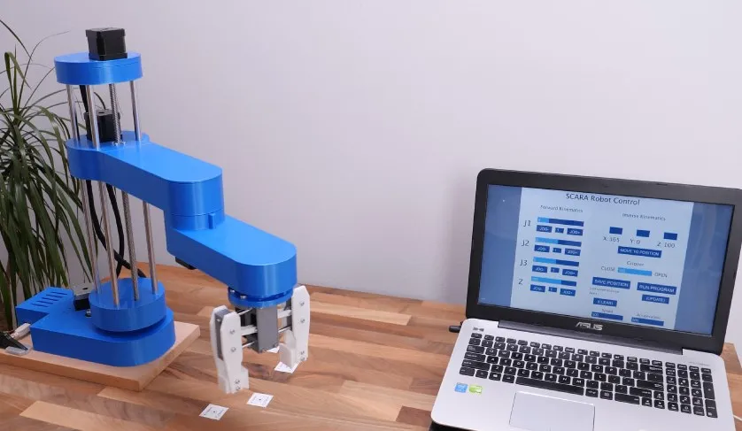

# SCARA Robot Pick-and-Place System

This project showcases a SCARA (Selective Compliance Articulated Robot Arm) I built for high-precision automation.

---

## Overview
- Designed and 3D-printed all robotic parts using SolidWorks.
- Simulated in ROS2 and Gazebo for kinematic validation.
- Implemented Python-based control with PID and inverse kinematics.
- Used encoders for real-time feedback and closed-loop control.

---

## Technologies Used
- ROS2, Gazebo, Python
- SolidWorks, 3D Printing (Bambu Lab X1 Carbon)
- Embedded Systems: STM32, Rotary Encoders

---

## Outcome
- Real-time positioning and smooth motion execution.
- Validated pick-and-place sequences in both simulation and hardware.
- Served as a foundation for future robotic workcells.

---

## Media

---

## Files

- [code](./code/) – Python control code and scripts
- [models](./models/) – CAD files and robot arm models  
- [docs](./docs/) – System diagrams, planning notes, and design documentation

---

[Back to Portfolio](../README.md)

